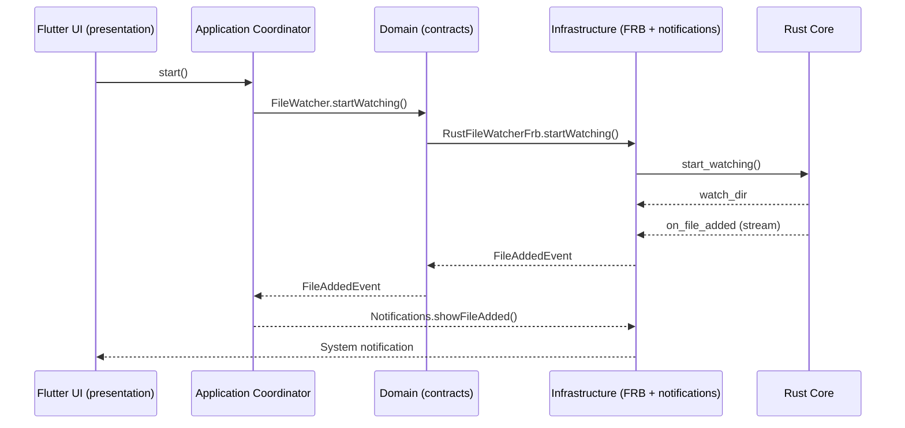
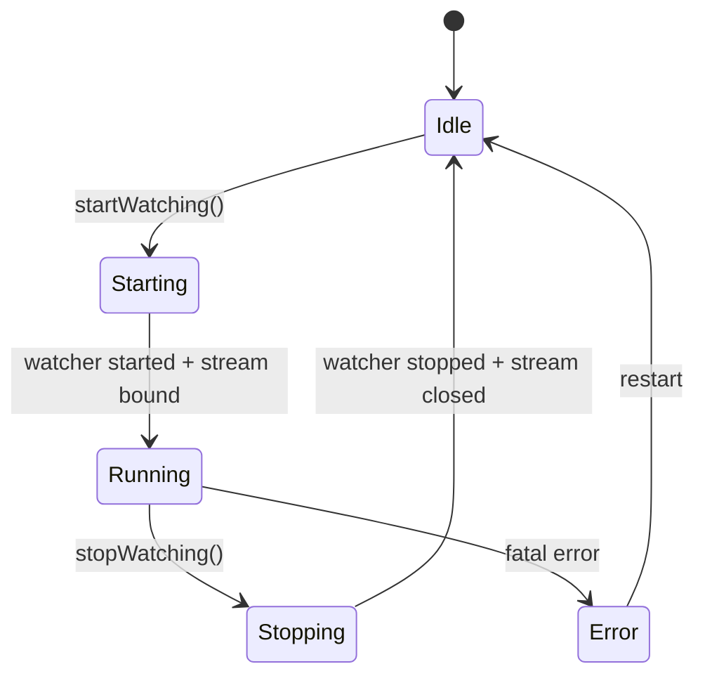

# Latera — архитектурная основа (foundation)

Цель: профессиональная база для desktop-приложения локального поиска.

Текущий статус репозитория:

- Flutter desktop каркас (Windows-first).
- Чистая раскладка слоёв `presentation/application/domain/infrastructure`.
- Инфраструктурный сервис уведомлений через `flutter_local_notifications`.
- Rust Core + `flutter_rust_bridge` подключены: file watcher, события, уведомления.

Rust Core + `flutter_rust_bridge` будут подключены следующим шагом после установки Rust toolchain (rustup/cargo). Сейчас в Flutter используется безопасная `no-op` заглушка watcher, чтобы приложение компилировалось и UI мог развиваться независимо.

## Слои Flutter

Структура:

- [`flutter/lib/presentation/`](../flutter/lib/presentation:1) — UI (виджеты, экраны). Без прямых интеграций.
- [`flutter/lib/application/`](../flutter/lib/application:1) — orchestration/координаторы use-case’ов (подписки на события, политика уведомлений).
- [`flutter/lib/domain/`](../flutter/lib/domain:1) — сущности/контракты (интерфейсы). Без Flutter-плагинов.
- [`flutter/lib/infrastructure/`](../flutter/lib/infrastructure:1) — реализации (плагины, bridge к Rust в будущем).

## Rust Core (текущее состояние)

Требования к Rust:

- Полностью локально, без интернета.
- OS-specific операции внутри Rust.
- Определить Desktop path и дефолт `Desktop/Latera` (путь должен быть конфигурируемым, но дефолт выбирается в Rust).
- Создавать папку при отсутствии.
- Наблюдать события `notify` (создание нового файла) и отдавать stream событий во Flutter.
- Graceful shutdown.

Интеграция:

- `flutter_rust_bridge` (runtime)
- `flutter_rust_bridge_codegen` (генерация)

## Потоки данных (текущее состояние)

## Жизненный цикл watcher (целевое поведение)

## Наблюдение и устойчивость (план стабилизации)

- Дедупликация: окно 300 мс по пути/имени.
- Лимит: 200 событий/сек.
- При превышении — batch-событие (до 200 элементов) вместо одиночных.
- Устойчивость к burst-ивентам и повторным notify-сигналам.

## Граница FRB (контракты)

### Единая точка входа

Все операции проходят через единый модуль FRB (`rust/api.rs`). Публичные типы и
функции определяются только в нём, чтобы:

- исключить разрозненные endpoints;
- централизовать модель ошибок и версионирование;
- иметь стабильный контракт между Rust и Dart.

### Версионирование API

Rust Core возвращает версию API через `get_api_version()`.

- Версия следует SemVer: `MAJOR.MINOR.PATCH`.
- Dart обязан проверять совместимость по `MAJOR`.

### Модель событий

Целевой контракт — типизированные события:

- `FileEvent` (универсальный контейнер)
- `FileEventType`: `Added | Modified | Renamed | Removed`
- `old_path` — только для `Renamed`

Текущий контракт (до завершения codegen):

- `FileAddedEvent` — одиночное событие (на базе notify Create)

### Модель ошибок Rust → Dart

Целевая модель ошибок — структурированная и машиночитаемая:

- `LateraApiError` (`code`, `message`, `details`)
- `ErrorCode`: `DesktopDirNotFound | InvalidPath | WatcherAlreadyRunning |
  WatcherNotRunning | Io | Notify | FileNameMissing | Unknown`

Схема обеспечивает:

- корректное отображение сообщений в UI;
- возможность error-aware поведения на Dart стороне;
- единое место маппинга ошибок Rust Core.

## Расширение (SQLite/FTS5/семантика)

Под дальнейшую эволюцию:

- индексатор файлов (domain/application) → SQLite (infrastructure) → FTS5.
- семантика: локальные эмбеддинги + векторный индекс (в Rust core, без сети).
- Free/Pro: через feature-flags/политику в application слое и разнесённые модули.

