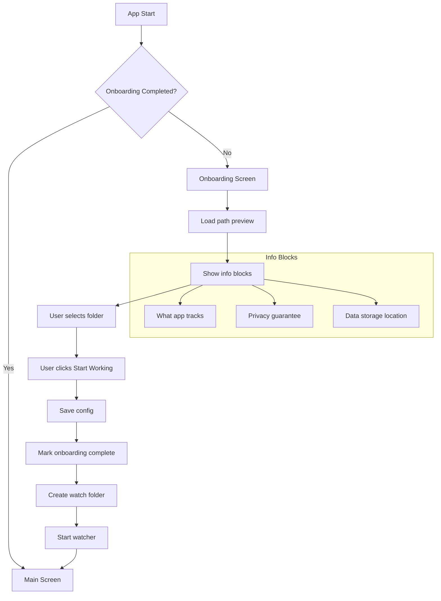

# Onboarding UX Improvements

## Problem Statement

Current implementation has issues that could be red flags for Microsoft Store moderation:

1. **Folder created before user consent** - `get_default_watch_path()` creates `Desktop/Latera` folder immediately when onboarding screen loads
2. **Insufficient privacy information** - No explicit statement that data doesn't leave the device
3. **No index location disclosure** - Users aren't told where their search index is stored
4. **Unclear tracking scope** - Users don't understand what exactly is being monitored

## Current Architecture

### Data Storage
- **User files**: Not copied or moved, only monitored
- **Search index**: stored locally on the device (SQLite FTS5 + service files like WAL/SHM, optional vector index).
  The actual resolved path may differ under MSIX / sandboxing, so it must be obtained at runtime and shown to the user.
- **Configuration**: SharedPreferences (future migration to SQLite planned)

### Current Flow (Problematic)
```
OnboardingScreen._loadDefaultPath()
  -> RustCore.getDefaultWatchPath()
    -> Rust: get_default_watch_path()
      -> ensure_default_watch_dir()
        -> std::fs::create_dir_all()  // PROBLEM: Creates folder before consent!
```

## Proposed Solution

### 1. Rust API Changes

#### New Function: `get_default_watch_path_preview()`
Returns path without creating the folder.

```rust
/// Get default watch path WITHOUT creating the directory.
/// Used for preview in onboarding before user consent.
pub fn get_default_watch_path_preview() -> Result<String, LateraError> {
    logging::init_logging();
    
    let desktop = dirs::desktop_dir()
        .ok_or(LateraError::DesktopDirNotFound)?;
    let watch_dir = desktop.join(DEFAULT_WATCH_FOLDER_NAME);
    
    // Return path string without creating directory
    Ok(watch_dir.to_string_lossy().to_string())
}
```

#### New Function: `get_index_path()`
Returns the actual index storage path (for displaying in UI).

```rust
/// Get the path where search index is stored.
/// Used to show user where their data is located.
/// Must return a resolved absolute path (MSIX/sandbox safe).
pub fn get_index_path() -> Result<String, LateraError> {
    // Should be based on OS-provided local app data directory (e.g. dirs::data_local_dir)
    // and the app-specific subdirectory.
    // Must NOT hardcode %LOCALAPPDATA%.
}
```

#### Keep Existing: `get_default_watch_path()`
Still creates folder - used after user consent.

### 2. Onboarding Screen UX Changes

#### Important: Wording Guidelines

**DO NOT:**
- Use absolute promises like "NEVER read" or "no telemetry" - architecture may change
- Hardcode paths like `%LOCALAPPDATA%` - MSIX sandbox may change actual path
- Use CAPS or aggressive marketing tone - Store prefers calm, legal-friendly language

**DO:**
- Use future-proof wording: "processed locally" instead of "never read"
- Get actual path from Rust API at runtime
- Keep tone neutral and legally accurate
- Focus on what matters: data doesn't leave the device

#### Layout Structure
```
+------------------------------------------+
|         [Folder Icon]                    |
|                                          |
|    "Добро пожаловать в Latera"           |
|    Краткое описание                      |
|                                          |
+------------------------------------------+
|  Что отслеживает приложение              |
|  • Только новые файлы в выбранной папке  |
|  • Имена и пути файлов для поиска        |
|  • Содержимое обрабатывается локально    |
+------------------------------------------+
|  Конфиденциальность                      |
|  • Данные не покидают устройство         |
|  • Файлы и их содержимое не передаются   |
|    в интернет                            |
+------------------------------------------+
|  Где хранятся данные                     |
|  Индекс: [путь из Rust API]              |
|  Настройки: локальное хранилище          |
+------------------------------------------+
|  Выбор папки                             |
|  [Выбрать папку...]                      |
|  [Использовать по умолчанию: Desktop/Latera] |
+------------------------------------------+
|                                          |
|  [      Начать работу      ]             |
|  "Папку можно изменить в настройках"     |
|                                          |
|  [Политика конфиденциальности]           |
+------------------------------------------+
```

#### Information Blocks (Russian)

**What the app tracks:**
```
"Latera отмечает новые файлы в выбранной папке."
"Имена и пути файлов используются для поиска."
"Содержимое файлов обрабатывается локально."
```

**Privacy guarantee:**
```
"Данные не покидают ваше устройство."
"Файлы и их содержимое не передаются в интернет."
```

**Data storage:**
```
"Расположение индекса:"
"[путь полученный из Rust API]"
```

### 3. Flow Changes

#### New Flow (Correct)
```
OnboardingScreen loads
  -> RustCore.getDefaultWatchPathPreview()  // NEW: No folder creation
    -> Shows path preview
    -> User sees all privacy info
    -> User clicks "Start Working"
      -> configService.updateValue(watchPath)
      -> configService.completeOnboarding()
      -> Navigate to /main
        -> MainScreen initializes
          -> FileEventsCoordinator.start()
            -> Rust: start_watching()
              -> ensure_default_watch_dir()  // NOW creates folder
```

### 4. Implementation Checklist

#### Rust Changes
- [ ] Add `get_default_watch_path_preview()` function in `api.rs`
- [ ] Add `get_index_path()` function in `api.rs`
- [ ] Add `get_default_watch_dir_preview()` in `file_watcher/mod.rs`
- [ ] Run FRB codegen to generate Dart bindings

#### Flutter Changes
- [ ] Update `RustCore` to call new preview function
- [ ] Redesign `OnboardingScreen` with info blocks
- [ ] Add privacy and data storage information
- [ ] Ensure folder creation happens only after consent

#### Testing
- [ ] Verify folder is NOT created when onboarding loads
- [ ] Verify folder IS created after "Start Working" click
- [ ] Verify all info blocks are displayed correctly

## Mermaid Diagram: Onboarding Flow



## Store Moderation Benefits

1. **Transparent data practices** - Clear disclosure of what data is collected
2. **User consent before file system access** - Folder created only after explicit action
3. **Offline-first clearly stated** - No internet dependency
4. **Data location disclosed** - Users know where their index is stored
5. **Privacy policy link** - Required for Store submission

## Additional Requirements

### Privacy Policy Link
- URL: `https://voron.github.io/latera/privacy`
- Add link to privacy policy at bottom of onboarding screen
- Link opens in external browser
- Text: "Политика конфиденциальности" (localized)
- Create privacy policy page in `/docs/privacy.md` for GitHub Pages

### Localization Support
- Default language: System language
- Language can be changed in Settings
- Use Flutter's `flutter_localizations` + `intl` packages
- Create ARB files for:
  - Russian (ru) - primary
  - English (en) - secondary
- All UI strings must be localized

#### Localization Setup Steps
1. Add dependencies to `pubspec.yaml`:
   ```yaml
   dependencies:
     flutter_localizations:
       sdk: flutter
     intl: ^0.19.0
   ```

2. Create ARB files:
   - `lib/l10n/app_ru.arb` - Russian strings
   - `lib/l10n/app_en.arb` - English strings

3. Configure `l10n.yaml`:
   ```yaml
   arb-dir: lib/l10n
   template-arb-file: app_ru.arb
   output-localization-file: app_localizations.dart
   ```

4. Update `LateraApp` to support localization:
   ```dart
   MaterialApp(
     localizationsDelegates: [
       AppLocalizations.delegate,
       GlobalMaterialLocalizations.delegate,
       GlobalWidgetsLocalizations.delegate,
       GlobalCupertinoLocalizations.delegate,
     ],
     supportedLocales: [
       Locale('ru'),
       Locale('en'),
     ],
   )
   ```

5. Use localized strings:
   ```dart
   Text(AppLocalizations.of(context)!.welcomeTitle)
   ```

## Questions Resolved

- **Index location**: resolved local app data directory (displayed in UI via Rust API)
- **Onboarding style**: Single screen with expanded info blocks
- **Folder creation timing**: After user clicks "Start Working"
- **User consent**: Button "Начать работу" is sufficient (no checkbox needed)
- **Privacy policy**: Link required at bottom of onboarding
